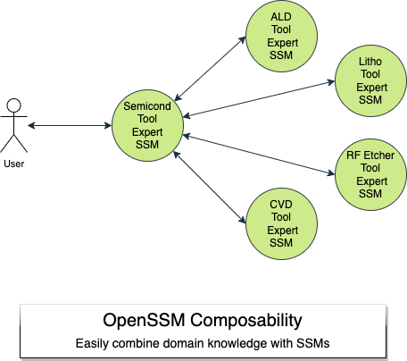

# OpenSSM – “Small Specialist Models” for Industrial AI

> &nbsp;
> See full documentation at [aitomatic.github.io/openssm/](https://aitomatic.github.io/openssm/).
> &nbsp;

OpenSSM (pronounced `open-ess-ess-em`) is an open-source framework for Small Specialist Models (SSMs), which are key to enhancing trust, reliability, and safety in Industrial-AI applications.  Harnessing the power of domain expertise, SSMs operate either alone or in "teams". They collaborate with other SSMs, planners, and sensors/actuators to deliver real-world problem-solving capabilities.

Unlike Large Language Models (LLMs), which are computationally intensive and generalized, SSMs are lean, efficient, and designed specifically for individual domains. This focus makes them an optimal choice for businesses, SMEs, researchers, and developers seeking specialized and robust AI solutions for industrial applications.

A prime deployment scenario for SSMs is within the aiCALM (Collaborative Augmented Large Models) architecture. aiCALM represents a cohesive assembly of AI components tailored for sophisticated problem-solving capabilities. Within this framework, SSMs work with General Management Models (GMMs) and other components to solve complex, domain-specific, and industrial problems.

## Why SSM?

The trend towards specialization in AI models is a clear trajectory seen by many in the field.

<!-- markdownlint-disable MD028 -->
> &nbsp;
> _Specialization is crucial for quality .. not general purpose Al models_ – Eric Schmidt, Schmidt Foundation
> &nbsp;

> &nbsp;
> _.. small models .. for a specific task that are good_ –  Matei Zaharia, Databricks
> &nbsp;

> &nbsp;
> _.. small agents working together .. specific and best in their tasks_ – Harrison Chase, Langchain
> &nbsp;

> &nbsp;
> _.. small but highly capable expert models_ – Andrej Karpathy, OpenAI
> &nbsp;

> &nbsp;
> _.. small models are .. a massive paradigm shift .. about deploying AI models at scale_ – Rob Toews, Radical Ventures
> &nbsp;
<!-- markdownlint-enable MD028 -->

As predicted by Eric Schmidt and others, we will see “a rich ecosystem to emerge [of] high-value, specialized AI systems.” SSMs are the central part in the architecture of these systems.

## What OpenSSM Offers

OpenSSM fills this gap directly, with the following benefits to the community, developers, and businesses:

- **Industrial Focus:** SSMs are developed with a specific emphasis on industrial applications, addressing the unique requirements of trustworthiness, safety, reliability, and scalability inherent to this sector.

- **Fast, Cost-Effective & Easy to Use:** SSMs are 100-1000x faster and more efficient than LLMs, making them accessible and cost-effective particularly for industrial usage where time and resources are critical factors.

- **Easy Knowledge Capture:** OpenSSM has easy-to-use tools for capturing domain knowledge in diverse forms: books, operaring manuals, databases, knowledge graphs, text files, and code.

- **Powerful Operations on Captured Knowledge:** OpenSSM enables both knowledge query and inferencing/predictive capabilities based on the domain-specific knowledge.

- **Collaborative Problem-Solving**: SSMs are designed to work in problem-solving "teams". Multi-SSM collaboration is a first-class design feature, not an afterthought.

- **Reliable Domain Expertise:** Each SSM has expertise in a particular field or equipment, offering precise and specialized knowledge, thereby enhancing trustworthiness, reliability, and safety for Industrial-AI applications. With self-reasoning, causal reasoning, and retrieval-based knowledge, SSMs provide a trustable source of domain expertise.

- **Vendor Independence:** OpenSSM allows everyone to build, train, and deploy their own domain-expert AI models, offering freedom from vendor lock-in and security concerns.

- **Composable Expertise**: SSMs are fully composable, making it easy to combine domain expertise.

## Target Audience

Our primary audience includes:

- **Businesses and SMEs** wishing to leverage AI in their specific industrial context without relying on extensive computational resources or large vendor solutions.

- **AI researchers and developers** keen on creating more efficient, robust, and domain-specific AI models for industrial applications.

- **Open-source contributors** believing in democratizing industrial AI and eager to contribute to a community-driven project focused on building and sharing specialized AI models.

- **Industries** with specific domain problems that can be tackled more effectively by a specialist AI model, enhancing the reliability and trustworthiness of AI solutions in an industrial setting.

## SSM Architecture

At a high level, SSMs comprise a front-end Small Language Model (SLM), an adapter layer in the middle, and a wide range of back-end domain-knowledge sources. The SLM itself is a small, efficient, language model, which may be domain-specific or not, and may have been distilled from a larger model. Thus, domain knowledge may come from either, or both, the SLM and the backends.

The above diagram illustrates the high-level architecture of an SSM, which comprises three main components:

1. Small Language Model (SLM): This forms the communication frontend of an SSM.

2. Adapters (e.g., LlamaIndex): These provide the interface between the SLM and the domain-knowledge backends.

3. Domain-Knowledge Backends: These include text files, documents, PDFs, databases, code, knowledge graphs, models, other SSMs, etc.

SSMs communicate in both unstructured (natural language) and structured APIs, catering to a variety of real-world industrial systems.

The composable nature of SSMs allows for easy combination of domain-knowledge sources from multiple models.

## Getting Started

See our [Getting Started Guide](docs/GETTING_STARTED.md) for more information.

## Roadmap

- Play with SSMs in a hosted SSM sandbox, uploading your own domain knowledge

- Create SSMs in your own development environment, and integrate SSMs into your own AI apps

- Capture domain knowledge in various forms into your SSMs

- Train SLMs via distillation of LLMs, teacher/student approaches, etc.

- Apply SSMs in collaborative problem-solving AI systems

## Community

Join our vibrant community of AI enthusiasts, researchers, developers, and businesses who are democratizing industrial AI through SSMs.  Participate in the discussions, share your ideas, or ask for help on our [Community Discussions](https://github.com/aitomatic/openssm/discussions).

## Contribute

OpenSSM is a community-driven initiative, and we warmly welcome contributions. Whether it's enhancing existing models, creating new SSMs for different industrial domains, or improving our documentation, every contribution counts. See our [Contribution Guide](docs/community/CONTRIBUTING.md) for more details.

## License

OpenSSM is released under the [Apache 2.0 License](docs/LICENSE.md).
