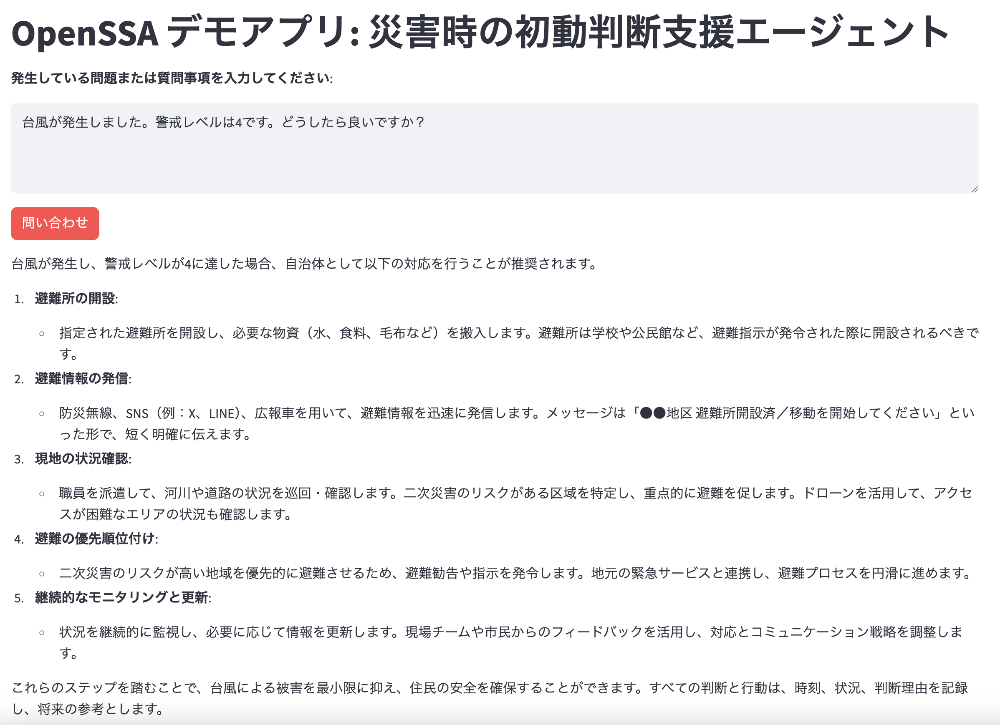

# OpenSSA デモアプリ: 災害時の初動判断支援

災害発生時における初動判断を支援するための AI エージェントアプリケーションです。  
本アプリは [OpenSSA](https://github.com/aitomatic/openssa) フレームワークを活用し、専門知識に基づいた計画立案を自動化します。



## 主な機能

- 災害発生状況（例：台風、地震）に対する初動対応の助言
- 専門知識と階層的プログラムによる計画生成
- Streamlit UI によるインタラクティブな操作
- 日本語での応答対応

## セットアップ方法

### 0. 前提

- [uv](https://github.com/astral-sh/uv)がインストール済みであること
- OpenAIのAPIキーを発行していること

### 1. クローン

```sh
git clone https://github.com/aitomatic/openssa.git
cd examples/japanese-demo-knowledge-program
```

### 2. `.env`ファイル設定

```sh
cp .env.template .env
```

`.env`ファイルにOpenAIのAPIキーを設定する。

### 3. 依存パッケージのインストール

```sh
uv sync
```

### 4. アプリケーションアクセス

```sh
source .venv/bin/activate
streamlit run app.py
```
