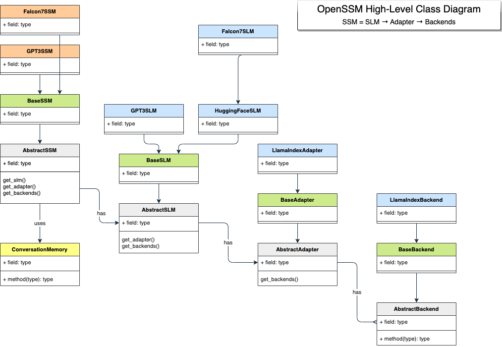

# OpenSSA Framework Library

## High-Level Class Diagram

## Package Structure

- `openssa`: Root package for OpenSSA.
  - `openssa.core`: Core functionalities of the SSMs.
    - `openssa.core.ssm`: Small Specialist Model (SSM) functionality.
      - `openssa.core.ssm.openai_ssm`: OpenAI API SSM implementations.
      - `openssa.core.ssm.huggingface_ssm`: HuggingFace API SSM implementations.
    - `openssa.core.slm`: Component: Small Language Model (SLM) functionality.
      - `openssa.core.ssm.openai_slm`: OpenAI API SLM implementations.
      - `openssa.core.ssm.huggingface_slm`: HuggingFace API SLM implementations.
    - `openssa.core.adapter`: Component: Interface between the SLM and the domain-knowledge backends.
    - `openssa.core.backend`: Component: Interfaces to a variety of domain-knowledge backends.
    - `openssa.core.inferencer`: Component: Inference wrapper for models behind SSM backends.
  - `openssa.capture`: Tools and APIs for capturing and encoding domain knowledge into various backends.
  - `openssa.composer`: Tools for composing multiple SSMs together.
  - `openssa.industrial`: Industrial-AI specific tools and APIs (trust, reliability, safety, etc.)
  - `openssm.integration`: Tools for integrating SSMs into industrial applications.

- `tests`: Unit tests for the framework's components (located at the top level of the project).

- `apps`: Example applications using SSMs (located at the top level of the project).

- `docs`: OpenSSA project documentation (located at the top level of the project).

## Getting Started

You can begin contributing to the OpenSSA project or use our pre-trained SSMs for your industrial projects. See our [Getting
Started Guide](link-to-guide) for more information.

## Community

Join our vibrant community of AI enthusiasts, researchers, developers, and businesses who are democratizing industrial AI
through SSMs. Participate in the discussions, share your ideas, or ask for help on our [Community Forum](link-to-forum).

## Contribute

OpenSSA is a community-driven initiative, and we warmly welcome contributions. Whether it's enhancing existing models,
creating new SSMs for different industrial domains, or improving our documentation, every contribution counts. See our
[Contribution Guide](../docs/CONTRIBUTING.md) for more details.

## License

OpenSSA is released under the [Apache 2.0 License](../LICENSE.md).
