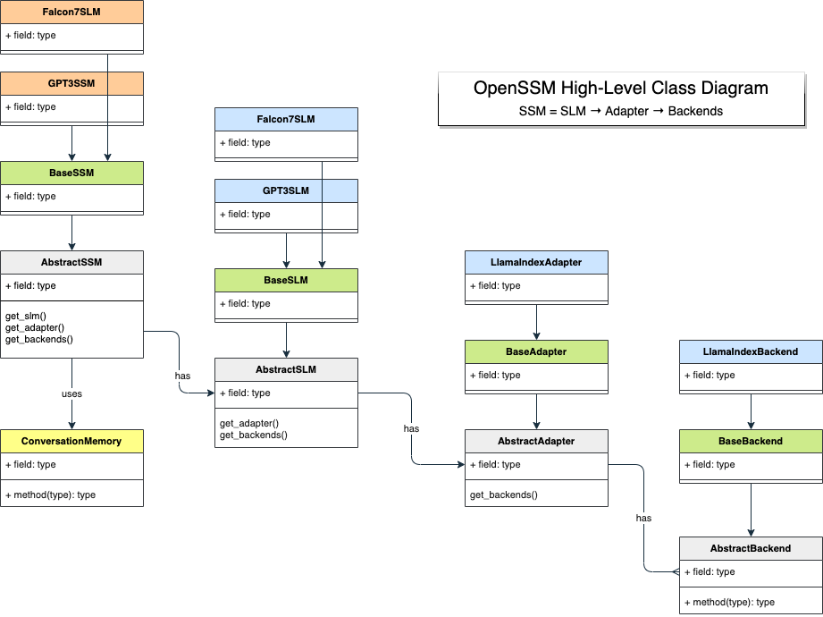

## OpenSSM Framework Library

## High-Level Class Diagram

## Package Structure
- `openssm`: Root package for OpenSSM. 
  - `openssm.core`: Core functionalities of the SSMs. 
    - `openssm.core.slm`: Small Language Model (SLM) functionality.
    - `openssm.core.adapter`: Interface between the SLM and the domain-knowledge backends.
    - `openssm.core.backend`: Interfaces to a variety of domain-knowledge backends.
  - `openssm.capture`: Tools and APIs for capturing and encoding domain knowledge into various backends.
  - `openssm.composer`: Tools for composing multiple SSMs together.
  - `openssm.utils`: Utility functions and classes.

- `tests`: Unit tests for the framework's components (located at the top level of the project).

- `apps`: Example applications using SSMs (located at the top level of the project).

- `docs`: OpenSSM project documentation (located at the top level of the project).

## Getting Started
You can begin contributing to the OpenSSM project or use our pre-trained SSMs for your industrial projects. See our [Getting
Started Guide](link-to-guide) for more information.

## Community
Join our vibrant community of AI enthusiasts, researchers, developers, and businesses who are democratizing industrial AI
through SSMs. Participate in the discussions, share your ideas, or ask for help on our [Community Forum](link-to-forum).

## Contribute
OpenSSM is a community-driven initiative, and we warmly welcome contributions. Whether it's enhancing existing models,
creating new SSMs for different industrial domains, or improving our documentation, every contribution counts. See our
[Contribution Guide](../docs/CONTRIBUTING.md) for more details.

## License
OpenSSM is released under the [Apache 2.0 License](../LICENSE.md).