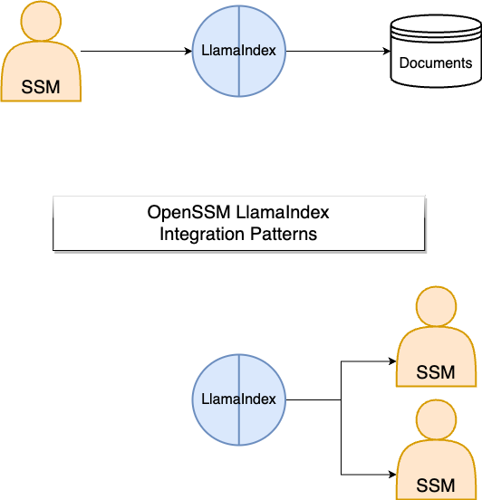

# OpenSSM and LlamaIndex Integration

This guide provides an overview and examples of how Small Specialist Models (SSMs, from the [OpenSSM](https://github.com/aitomatic/openssm) project) integrate with LlamaIndex.

## Overview

SSMs are designed to be private, secure, domain-specific models (or AI agents) for industrial applications. LlamaIndex is a simple, flexible data framework for connecting custom data sources to LLMs.

As such, there are two major integration patterns:

1. SSMs comprising LlamaIndex in its backend, for data access, e.g., via retrieval-augmented generation.

2. SSMs serving as data sources or data agents for LlamaIndex, e.g., for multi-agent sourcing and planning.



When integrated, both bring unique benefits that greatly enhance their collective capabilities. SSMs can leverage LlamaIndex to access specific, contextually relevant data, enhancing their specialist capabilities. Conversely, SSMs, as data sources for LlamaIndex, contribute their nuanced domain knowledge to a broader data ecosystem.

Additionally, this integration promotes efficiency and customization, thanks to LlamaIndex’s flexibility in handling different data formats and SSMs’ computational advantages (e.g., from domain-specific, fine-tuned, distilled language models). The relationship between SSMs and LlamaIndex enriches the the LlamaIndex ecosystem and while helping to improve the robustness and reliability of SSMs.

## Integration Examples

Here are some examples to get you started.

### Basic Integration

OpenSSM makes using LlamaIndex as simple as 3 lines of code:

```python
from openssm import LlamaIndexSSM  # Instantiate a LlamaIndexSSM

ssm = LlamaIndexSSM()
ssm.read_directory('docs/ylecun')  # Read the docs for the first time

ssm.discuss("What is the main point made by Yann LeCun?")  # Interact with the SSM
```

Persistence is just as straightforward:

```python
ssm.save('storage/ylecun')  # Save the index to storage

ssm.load('storage/ylecun')  # Load the index from storage
```

### Domain-specific SSM

In the example below, we put a domain-specific SSM (an SLM or small language model trained on data related to Yann LeCun’s work) in front of LlamaIndex.

```python
from openssm import LlamaIndexSSM, FineTunedSLM

slm = FineTunedSLM(...)  # Instantiate a domain-specific SLM
ssm = LlamaIndexSSM(slm=slm) # Instantiate a LlamaIndexSSM with the SLM
ssm.read_directory('docs/ylecun') # Read the docs

response = ssm.discuss("What is the main point made by Yann LeCun?")
```

The response from this ssm would be much richer and more informed about Yann LeCun’s work than a generic SSM performing the same task.

In all of the above examples, the SSM is using LlamaIndex as a [`Backend`](/openssm/core/backend/abstract_backend), as shown below.


### Advanced Use Cases with LlamaIndex’s Data Agents

LlamaIndex’s Data Agents, with their ability to dynamically read, write, search, and modify data across diverse sources, are a game changer for complex and automated tasks. Here, we cover three primary use cases:

Here, we cover three primary use cases:

#### Context Retrieval

An agent can retrieve context-specific data to inform responses. For example, in a financial setting:

```python
from openssm import LlamaIndexSSM, ContextRetrievalAgent

context = """
XYZ company reported Q2 revenues of $4.5 billion, up 18% YoY. The rise is primarily due to a 32% growth in their cloud division.
"""

agent = ContextRetrievalAgent(context)
ssm = LlamaIndexSSM(agents=[context_agent])
ssm.read_directory('docs/financial_reports')

response = ssm.discuss("What is the current financial performance of XYZ company?")
```

This agent can retrieve and analyze data from relevant financial reports, taking into account the context of recently reported Q2 revenues of $4.5 billion, to provide an informed response.

#### Function Retrieval

In cases where the set of tools is extensive, the agent can retrieve the most relevant ones dynamically during query time. For example, in a data analysis setting:

```python
from openssm import LlamaIndexSSM, FunctionRetrievalAgent

agent = FunctionRetrievalAgent('tools/data_tools')
ssm = LlamaIndexSSM(agents=[tool_agent])
ssm.read_directory('docs/financial_reports')

response = ssm.discuss("Perform a correlation analysis on the financial reports")
```

This allows the SSM to retrieve and apply the most suitable data analysis tool based on the request.

#### Query Planning

For more complex tasks, OpenSSM can be made capable of advanced query planning thanks to LlamaIndex. It could, for instance, plan and execute a series of queries to answer a question about a company’s revenue growth over specific months.

```python
from openssm import LlamaIndexSSM, QueryPlanningAgent

query_plan_tool = QueryPlanTool.from_defaults(
    query_engine_tools=[query_tool_sept, query_tool_june, query_tool_march]
)

agent = QueryPlanningAgent(tools=[query_tool_sept, query_tool_june, query_tool_march])
ssm = LlamaIndexSSM(agents=[agent])
ssm.read_directory('../tmp/docs/financial_reports')

response = ssm.discuss("What was the revenue growth of XYZ company from March through September?")
```

This illustrates how an SSM with a Query Planning Agent can plan and execute a series of queries to answer a complex question accurately.

### Future Enhancements

As we continue to enhance the integration between OpenSSM and LlamaIndex, here are a few promising directions:

- **SSMs as agents for LlamaIndex**: We are exploring ways to make SSMs available as agents for LlamaIndex, allowing for more complex interactions between SSMs and LlamaIndex.

- **Expansion to More Domain Areas**: We are planning to develop SSMs for more specific domains, such as healthcare, law, and finance, and integrate these with LlamaIndex.

- **Advanced Data Agents**: The development and inclusion of more advanced and specialized data agents is a key part of our roadmap.

- **Inter-Agent Communication**: We plan to introduce advanced inter-agent communication protocols, allowing for more complex interactions between SSMs.

- **Agent Collaboration on Complex Tasks**: Building on the inter-agent communication, we are also exploring ways for multiple SSMs to collaborate on more complex tasks.

## Summary

This guide provides an introduction to integrating Small Specialist Models (SSMs) with LlamaIndex. The relationship between the two enhance the performance of individual SSMs, and significantly elevates the utility of the broader AI ecosystem. This is particularly needed for industrial companies, where the ability to leverage domain-specific knowledge is critical for success.
